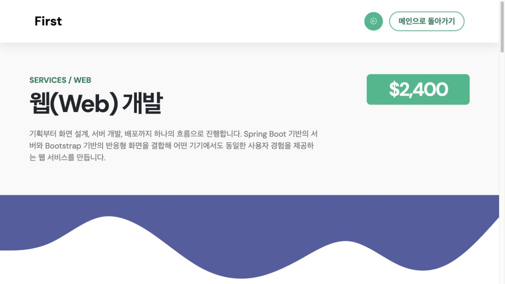
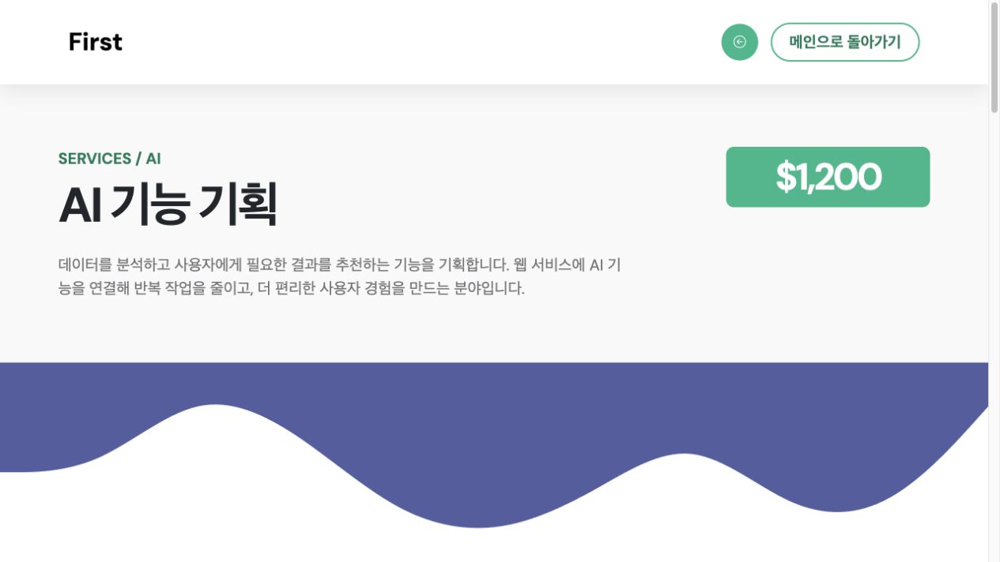
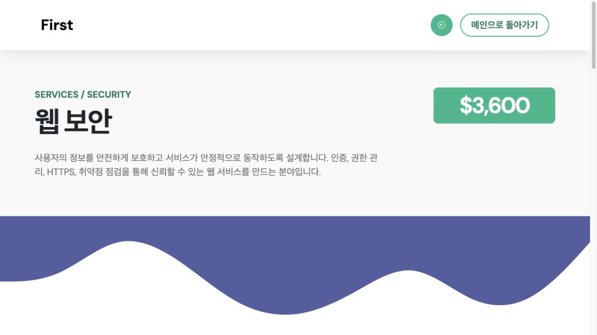
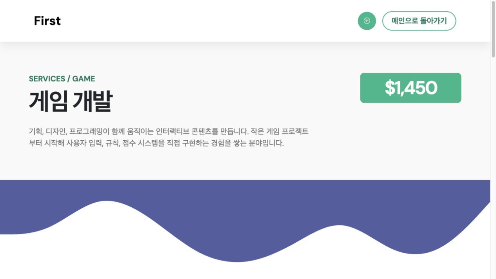

# Spring Boot 주차별 실습 정리

성결대학교 미디어소프트웨어학과 23학번 기경민의 Spring Boot 실습 프로젝트입니다.  
2주차는 Spring Boot 기본 실행과 URL 매핑, 3주차는 포트폴리오 프론트 화면 제작, 4주차는 MySQL 데이터베이스 연동, 5주차는 로그인/로그아웃과 비밀번호 암호화를 중심으로 진행했습니다.

## 개발 환경

| 구분 | 내용 |
| --- | --- |
| 언어 | Java 26 |
| 프레임워크 | Spring Boot 4.1.1 |
| 빌드 도구 | Maven |
| 템플릿 엔진 | Thymeleaf |
| 데이터베이스 | MySQL, H2 |
| 주요 라이브러리 | Spring Web, Spring Data JPA, Spring Security, Thymeleaf Security, Bootstrap 5, Bootstrap Icons |

## 실행 방법

```bash
./mvnw spring-boot:run
```

실행 후 브라우저에서 `http://localhost:8080/`으로 접속합니다.

| 페이지 | 주소 |
| --- | --- |
| 메인 포트폴리오 | `http://localhost:8080/` |
| 2주차 기본 페이지 | `http://localhost:8080/hello` |
| 2주차 연습 페이지 | `http://localhost:8080/hello2` |
| 4주차 DB 연동 페이지 | `http://localhost:8080/testdb` |
| 5주차 로그인 | `http://localhost:8080/login` |
| 5주차 회원가입 | `http://localhost:8080/signup` |
| 웹 개발 상세 | `http://localhost:8080/detailed_web.html` |
| AI 상세 | `http://localhost:8080/detailed_ai.html` |
| 보안 상세 | `http://localhost:8080/detailed_security.html` |
| 게임 개발 상세 | `http://localhost:8080/detailed_game.html` |

## 2주차: 개발 환경 설정 및 테스트

### 실습 목표

- Spring Boot 프로젝트 생성 및 실행
- Controller와 URL 매핑 이해
- Thymeleaf 템플릿에 Model 데이터 출력
- `/hello`, `/hello2` 페이지 작성

### 구현 내용

| 파일 | 설명 |
| --- | --- |
| `src/main/java/com/example/demo/DemoController.java` | `/hello`, `/hello2` URL 매핑 작성 |
| `src/main/resources/templates/hello.html` | 기본 메시지 출력 페이지 |
| `src/main/resources/templates/hello2.html` | 이름, 학번, 과목, 주차, 메시지 출력 페이지 |

### 주요 코드

```java
@GetMapping("/hello2")
public String hello2(Model model) {
    model.addAttribute("name", "기경민");
    model.addAttribute("studentId", "20230968");
    model.addAttribute("subject", "윈도우 프로그래밍");
    model.addAttribute("week", "2주차");
    model.addAttribute("message", "스프링 부트 URL 매핑과 컨트롤러 연습문제 완료");
    return "hello2";
}
```

### 실행 화면


## 3주차: 포트폴리오 프론트 작성

### 실습 목표

- TemplateMo First Portfolio 템플릿을 활용한 개인 포트폴리오 제작
- 자기소개, 일대기, 기술, 프로젝트, 연락 영역 수정
- 관심 분야별 상세 페이지 작성
- 이미지 크기와 레이아웃 조정

### 구현 내용

| 파일 | 설명 |
| --- | --- |
| `src/main/resources/templates/index.html` | 메인 포트폴리오 페이지 |
| `src/main/resources/static/images/profile.jpg` | 프로필 이미지 |
| `src/main/resources/static/css/templatemo-first-portfolio-style.css` | 포트폴리오 디자인 수정 |
| `src/main/resources/public/detailed_web.html` | 웹 개발 상세 페이지 |
| `src/main/resources/public/detailed_ai.html` | AI 상세 페이지 |
| `src/main/resources/public/detailed_security.html` | 보안 상세 페이지 |
| `src/main/resources/public/detailed_game.html` | 게임 개발 상세 페이지 |

### 메인 페이지 수정 사항

- 상단 소개 문구를 `성결대학교 미소과 23학번 기경민입니다.`로 수정
- `profile.jpg`를 적용해 본인 프로필 이미지 표시
- `갱's 일대기` 영역을 개인 소개 내용으로 작성
- 소개 영역 이미지 크기와 비율 조정
- 기술 영역을 `웹 개발`, `AI`, `보안`, `게임 개발`로 구성
- 각 기술 카드에 Bootstrap Icons 적용
- 각 기술 카드에서 상세 페이지로 이동하도록 링크 연결

### 상세 페이지 구성

| 분야 | 파일 | 가격 | 주요 내용 |
| --- | --- | --- | --- |
| 웹 개발 | `detailed_web.html` | `$2,400` | HTML, CSS, JavaScript, Spring Boot, REST API |
| AI | `detailed_ai.html` | `$1,200` | 데이터 분석, 모델 학습, AI 서비스 적용 |
| 보안 | `detailed_security.html` | `$3,600` | 인증, 권한, HTTPS, 웹 취약점 점검 |
| 게임 개발 | `detailed_game.html` | `$1,450` | 게임 기획, 로직 구현, 사용자 경험 |

### 실행 화면










## 4주차: 데이터베이스 연동 및 테스트

### 실습 목표

- MySQL 데이터베이스 생성
- Spring Boot와 MySQL 연결
- JPA Entity, Repository, Service 구조 작성
- DB 데이터를 Thymeleaf 화면에 출력

### MySQL 설정

```sql
CREATE DATABASE IF NOT EXISTS spring
    CHARACTER SET utf8mb4
    COLLATE utf8mb4_unicode_ci;

USE spring;

CREATE USER IF NOT EXISTS '본인계정'@'localhost' IDENTIFIED BY '본인비밀번호';
CREATE USER IF NOT EXISTS '본인계정'@'127.0.0.1' IDENTIFIED BY '본인비밀번호';

GRANT ALL PRIVILEGES ON spring.* TO '본인계정'@'localhost';
GRANT ALL PRIVILEGES ON spring.* TO '본인계정'@'127.0.0.1';

FLUSH PRIVILEGES;
```

같은 SQL은 `database-setup.sql`에 정리했습니다.

### Spring DB 설정

`src/main/resources/application.properties`

```properties
spring.datasource.url=jdbc:mysql://localhost:3306/spring?serverTimezone=Asia/Seoul&characterEncoding=UTF-8
spring.datasource.driver-class-name=com.mysql.cj.jdbc.Driver

spring.jpa.hibernate.ddl-auto=update
spring.jpa.show-sql=true
spring.jpa.properties.hibernate.format_sql=true
```

### 구현 내용

| 파일 | 설명 |
| --- | --- |
| `src/main/java/com/example/demo/model/domain/TestDB.java` | `testdb` 테이블과 매핑되는 Entity |
| `src/main/java/com/example/demo/model/repository/TestRepository.java` | DB 조회를 담당하는 Repository |
| `src/main/java/com/example/demo/model/service/TestService.java` | 전체 조회, 이름 조회, 샘플 데이터 저장 처리 |
| `src/main/java/com/example/demo/DemoController.java` | `/testdb` URL 매핑 추가 |
| `src/main/resources/templates/testdb.html` | DB 데이터 목록 출력 화면 |
| `src/test/resources/application-test.properties` | 테스트용 H2 DB 설정 |

### 주요 코드

```java
@GetMapping("/testdb")
public String testdb(Model model) {
    testService.saveSampleDataIfEmpty();

    TestDB test = testService.findByName("홍길동");
    List<TestDB> users = testService.findAll();

    model.addAttribute("test", test);
    model.addAttribute("users", users);
    model.addAttribute("count", users.size());
    return "testdb";
}
```

### 확인 결과

- MySQL에 `spring` 데이터베이스 생성 완료
- `testdb` 테이블 생성 완료
- 샘플 데이터 3개 저장 확인
- `/testdb` 페이지에서 DB 데이터 출력 확인
- `./mvnw test` 테스트 통과

## 5주차: 로그인, 로그아웃 및 암호화

### 실습 목표

- Spring Security 의존성 추가
- 로그인/로그아웃 기능 구현
- 회원가입 기능 구현
- BCrypt를 이용한 비밀번호 단방향 암호화
- 로그인 상태에 따라 네비게이션 버튼 변경
- 로그인하지 않은 사용자의 회원목록 페이지 접근 제한
- 로그인 상태 유지와 비밀번호 확인 검증 구현

### 구현 내용

| 파일 | 설명 |
| --- | --- |
| `src/main/java/com/example/demo/config/SecurityConfig.java` | 보안 설정, 로그인/로그아웃, remember-me 설정 |
| `src/main/java/com/example/demo/controller/MemberController.java` | 로그인 화면, 회원가입 화면, 회원가입 처리 |
| `src/main/java/com/example/demo/model/domain/Member.java` | `member` 테이블과 매핑되는 회원 Entity |
| `src/main/java/com/example/demo/model/dto/MemberForm.java` | 회원가입 화면에서 전달되는 DTO |
| `src/main/java/com/example/demo/model/repository/MemberRepository.java` | 회원 조회와 아이디 중복 확인 |
| `src/main/java/com/example/demo/model/service/MemberService.java` | 회원가입, BCrypt 암호화, 로그인 회원 조회 |
| `src/main/resources/templates/login.html` | 로그인 화면 |
| `src/main/resources/templates/signup.html` | 회원가입 화면 |
| `src/main/resources/templates/index.html` | 로그인 상태별 네비게이션 버튼 출력 |

### 보안 설정 요약

```java
@Bean
public PasswordEncoder passwordEncoder() {
    return new BCryptPasswordEncoder();
}

@Bean
public SecurityFilterChain securityFilterChain(HttpSecurity http) throws Exception {
    http
        .authorizeHttpRequests(auth -> auth
            .requestMatchers("/", "/hello", "/hello2", "/login", "/signup", "/error").permitAll()
            .requestMatchers("/css/**", "/js/**", "/images/**", "/fonts/**").permitAll()
            .anyRequest().authenticated()
        )
        .formLogin(form -> form
            .loginPage("/login")
            .defaultSuccessUrl("/")
            .failureUrl("/login?error")
            .permitAll()
        )
        .logout(logout -> logout
            .logoutUrl("/logout")
            .logoutSuccessUrl("/login?logout")
            .invalidateHttpSession(true)
            .deleteCookies("JSESSIONID", "remember-me")
        )
        .rememberMe(remember -> remember
            .key("gyeongmin-week5-remember-me")
            .tokenValiditySeconds(60 * 60 * 24 * 7)
        );

    return http.build();
}
```

### 회원가입 암호화

```java
member.setPassword(passwordEncoder.encode(form.getPassword()));
member.setRole("USER");
```

비밀번호는 DB에 평문으로 저장하지 않고 BCrypt 해시 값으로 저장합니다.  
또한 회원가입 시 `password`와 `passwordConfirm`을 비교하여 다르면 `비밀번호가 일치하지 않습니다.` 메시지를 출력합니다.

### 로그인 처리

```java
@Override
public UserDetails loadUserByUsername(String username) throws UsernameNotFoundException {
    Member member = memberRepository.findByUsername(username)
        .orElseThrow(() -> new UsernameNotFoundException("회원 없음 : " + username));

    return User.builder()
        .username(member.getUsername())
        .password(member.getPassword())
        .roles(member.getRole())
        .build();
}
```

Spring Security가 `loadUserByUsername()`으로 DB 회원을 조회하고, 입력한 비밀번호와 DB의 BCrypt 해시 값을 자동으로 비교합니다.

### DB 보안 설정 분리

`application.properties`에는 비밀 정보를 직접 적지 않고 아래처럼 분리했습니다.

```properties
spring.config.import=optional:application-secret.properties
```

`application-secret.properties`에는 DB 계정 정보가 들어가며, `.gitignore`에 추가하여 업로드되지 않도록 설정했습니다.

### 확인 결과

- `member` 테이블 자동 생성 확인
- 회원가입 성공 시 `/login?signup`으로 이동 확인
- 비밀번호 확인 불일치 시 오류 메시지 출력 확인
- 로그인 전 `/testdb` 접근 시 `/login`으로 이동 확인
- 로그인 후 메인 네비게이션에 `아이디님`과 로그아웃 버튼 출력 확인
- 로그인 후 `/testdb` 접근 가능 확인
- `./mvnw test` 테스트 통과

## 프로젝트 구조

```text
demo
├── database-setup.sql
├── pom.xml
├── readme.md
├── docs/images
├── src/main/java/com/example/demo
│   ├── DemoApplication.java
│   ├── DemoController.java
│   ├── config
│   ├── controller
│   └── model
├── src/main/resources
│   ├── application.properties
│   ├── public
│   ├── static
│   └── templates
└── src/test
```

## 최종 정리

이번 실습에서는 Spring Boot의 기본 구조부터 프론트 화면 구성, MySQL 데이터베이스 연동까지 단계적으로 구현했습니다.  
2주차에서는 Controller와 Thymeleaf 출력 흐름을 익혔고, 3주차에서는 개인 포트폴리오 페이지를 완성했으며, 4주차에서는 Spring Data JPA를 이용해 실제 DB 데이터를 화면에 출력했습니다. 5주차에서는 Spring Security를 적용하여 로그인, 로그아웃, 회원가입, 비밀번호 암호화까지 구현했습니다.
